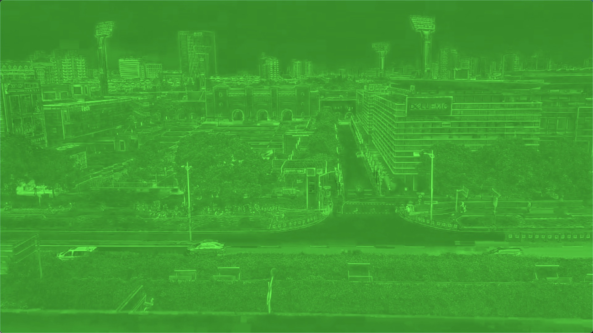
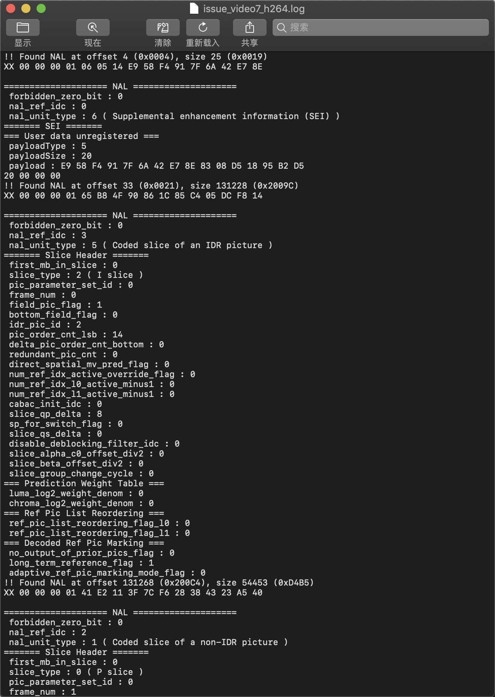
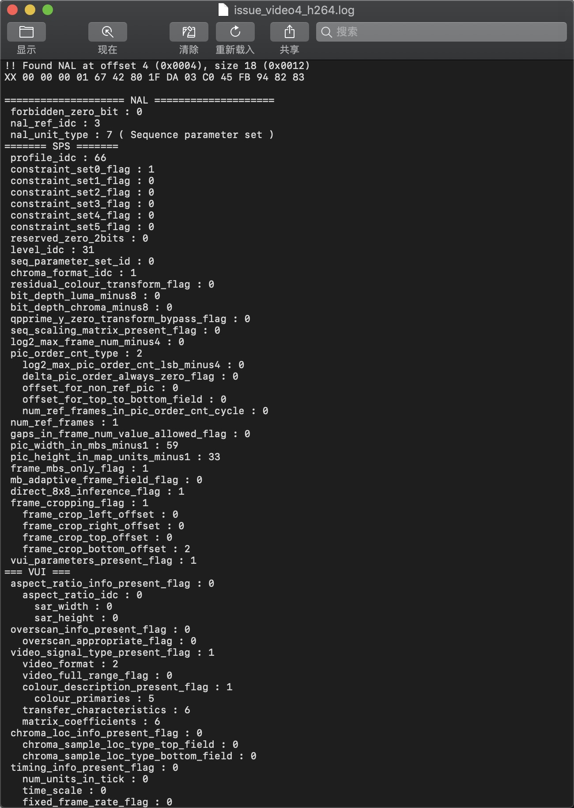
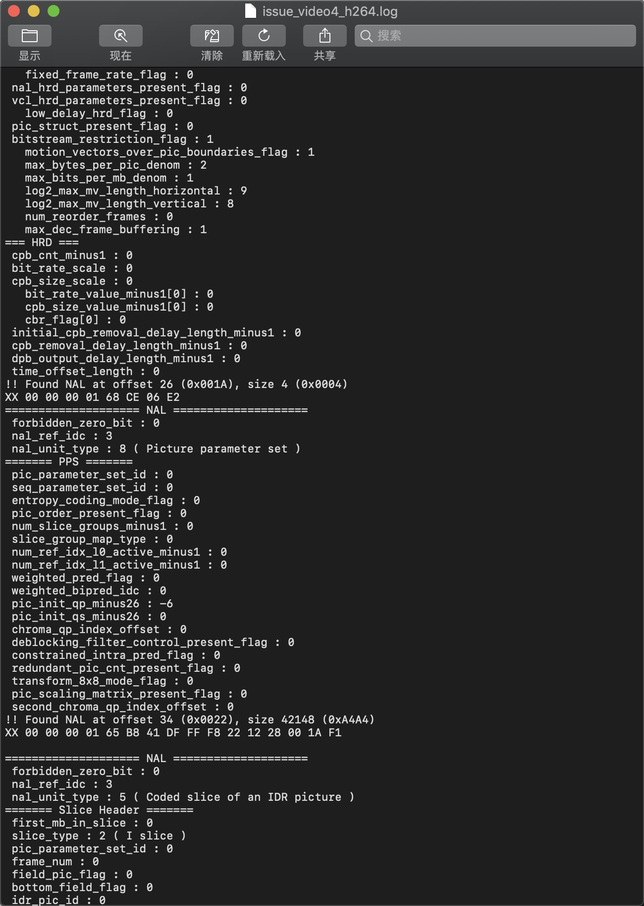
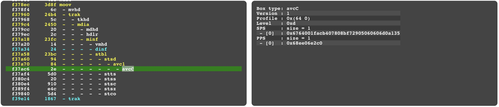

### 部分 Android 手机硬压视频和 IOS 播放器不兼容的问题
---

#### Android 硬压视频
通过 MediaExtractor 将 mp4 文件分解成 h264 码流文件和 aac 音频文件，再使用 MediaCodec 解码 h264 得到像素数据。降低画面分辨率、设置码率和关键帧间隔后通过 MediaCodec 重新编码得到 h264 文件，然后通过 mp4parser 将压缩后的 h264 码流和前面的 aac 音频文件重新合成 mp4 文件。因为音频数据占极少一部分，所以只对码流文件进行压缩。

#### 遇到的问题
一加 5T、小米手机压缩得到的视频在 IOS 系统上播放时刚开始几秒出现绿屏。  


#### 问题分析
通过调整关键帧间隔发现出问题的帧都位于第一个关键帧之后第二个关键帧之前，加上出问题的播放器都是苹果系的共用一块核心代码，所以怀疑是因为播放器没有正确读取到第一个关键帧信息，导致依赖它的帧都不能正常显示。

首先怀疑问题可能是第一个关键帧不存在，通过下面这条命令检查关键帧。

```
ffprobe -i issue_video.mp4 -select_streams v -show_frames -show_entries frame=pkt_dts_time,pict_type -v error -of csv | grep -n I
```

输出结果如下:

```
1:frame,0.000000,I
301:frame,10.003756,I
601:frame,20.007633,I
901:frame,30.011556,I
```

可以看到关键帧分别位于第 1、301、601、901 帧，对应的时间分别是第 0、10、20、30 秒，说明第一个关键帧是存在的，看来第一个怀疑是错的。

接下来从 mp4 文件中分离出 h264 码流数据分析它的 NAL 是否正常，分离 h264 命令如下：

```
ffmpeg -i issue_video.mp4 -vcodec copy -vbsf h264_mp4toannexb -an issue_video.h264
```

分析 NAL 我这里用的是 <https://sourceforge.net/projects/h264bitstream/> 这个工具，输出的结果如下:



从上面的截图中可以看到三个 NAL，type 分别为 6、5、1，分别指的是 SEI、IDR、non-IDR，这里的 IDR 就是第一个关键帧。

一个正常视频的 NAL log 如下，作为对比





可以看到正常视频的前三个 NAL type 分别是 7、8、5，分别指的是 SPS PPS IDR。sps/pps 一般包含了初始化 H264 解码器所需要的信息参数，包含编码所用的 profile，level，图像的宽高等信息，所以在将图像数据送入解码器之前必须先将 sps/pps 送入解码器。问题视频除第一个关键帧外的剩余三个关键帧之前都有 sps/pps，而这三个关键帧后的视频都能正常播放，更加证明了问题出在第一个关键帧之前没有 sps/pps。

分析到这一步只能说明问题视频 mp4 文件转成得到的 h264 文件有问题，但 mp4 文件中 sps/pps 是作为 meta 数据全局存在 avcC box 中的，如下图：



所以应该是在 mp4 文件转成 h264 过程中出问题了。通过再次对比问题视频和正常视频的 nal log 发现除了没有 sps/pps 之外还有一处不相同，问题视频在最开始的地方多了一个 SEI nal。SEI 全称 Supplemental enhancement information 即补充增强信息，可以理解为补充信息，一般用于存放用户自定义数据，如果和视频解码没关系时可直接忽略。它在 H264 码流中的位置需要满足下面条件：

> 如果存在SEI（补充增强信息） 单元的话，它必须在它所对应的基本编码图像的片段（slice）单元和数据划分片段（data partition）单元之前，并同时必须紧接在上一个基本编码图像的所有片段（slice）单元和数据划分片段（data partition）单元后边。假如SEI属于多个基本编码图像，其顺序仅以第一个基本编码图像为参照。[Reference](http://blog.sina.com.cn/s/blog_b849fc610101a50u.html)

怀疑问题视频的 SEI nal 不应该放在最开始，尝试在压缩后的 h264 码流中将 SEI nal 拿掉，视频可以正常播放了。所以这个播放不兼容的问题应该是苹果系播放器不能正常解析或者过滤掉位于文件开始的 SEI nal 导致的。

#### 解决方案

MediaCodec 编码后的数据中将 SEI nal 过滤掉。有的人可能会问直接拿掉这段数据会不会引起播放错误，Nal 数据的第一个字节 bit0 通常为 0，bit1-2 表示是否被别的 nal 数据引用：0 表示没被引用，非 0 表示被引用，越大表示越重要，bit3-7 表示 nal type。而 SEI nal 的第一个字节的 bit1-2 一般都是0 表示没有被引用，所以直接过滤掉不会引起错误。代码如下：

``` kotlin
private fun ByteBuffer.filterSEINalu(info: MediaCodec.BufferInfo): ByteBuffer {
    var seiFound = false
    var start = -1
    var totalByteArray = ByteArray(0)
    for (i in position()..limit()) {
        getStartCodeLength(i).takeIf { it > 0 && limit() > it + 1 }?.also {
            if (start >= 0) {
                totalByteArray += getArray(start, i)
            }
            val firstByte = get(i + it)
            if ((firstByte and 0x60) == 0.toByte() && (firstByte and 0x1F) == 6.toByte()) {
                if (seiFound.not()) {
                    seiFound = true
                    totalByteArray += getArray(position(), i)
                }
                start = -1
                RgLog.i("Found sei nalu index $i")
            } else if (seiFound) {
                start = i
            }
        }
        if (i == limit() && start >= 0) {
            totalByteArray += getArray(start, i)
        }
    }
    return if (seiFound) {
        info.size -= remaining() - totalByteArray.size
        ByteBuffer.wrap(totalByteArray)
    } else this
}

private fun ByteBuffer.getStartCodeLength(index: Int): Int {
    if (index < position() || index >= limit()) {
        return 0
    }
    if (this.limit() > index + 2
            && (index == position() || this[index - 1] != 0.toByte())
            && this[index] == 0.toByte()
            && this[index + 1] == 0.toByte()
            && this[index + 2] == 1.toByte()) {
        // 000001
        return 3
    } else if (this.limit() > index + 3
            && this[index] == 0.toByte()
            && this[index + 1] == 0.toByte()
            && this[index + 2] == 0.toByte()
            && this[index + 3] == 1.toByte()) {
        // 00000001
        return 4
    }
    return 0
}

private fun ByteBuffer.getArray(start: Int, end: Int): ByteArray {
    val byteArray = ByteArray(end - start)
    val oldPos = position()
    position(start)
    get(byteArray, 0, byteArray.size)
    position(oldPos)
    return byteArray
}
```
这段代码是用 kotlin 写的，主要是 ByteBuffer.filterSEINalu 这个方法，因为 nal 没有字段来表示数据的 length 而是通过 000001 或者 00000001 作为开始码来标记每个 nal，这里的 ByteBuffer.getStartCodeLength 就是用来判断是不是开始码。

```
if ((firstByte and 0x60) == 0.toByte() && (firstByte and 0x1F) == 6.toByte())
```

这行代码是用来判断这个 nal 是不是 SEI，并且以防万一确保没有别的 nal 引用它。